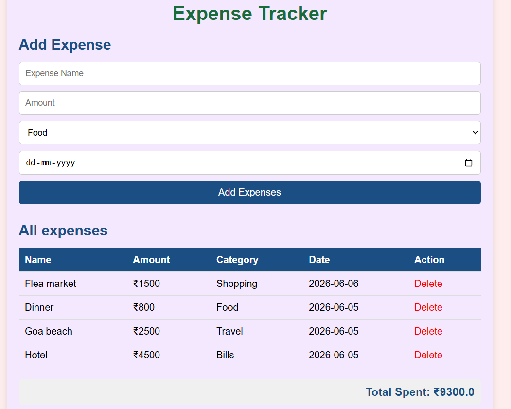

# Expense Tracker 💰

A full-stack expense tracking web application built with Python Flask and SQLite.

## Features
- Add daily expenses with name, amount, category and date
- View all expenses in a clean table
- Delete expenses
- Total amount calculation
- Categories: Food, Travel, Shopping, Bills, Education, Health, Entertainment

## Tech Used
Python | Flask | SQLite3 | HTML | CSS | JavaScript

## How to Run
1. Clone this repository
2. Install Flask: pip install flask
3. Run: python app.py
4. Open browser: http://127.0.0.1:5000

## Screenshot

